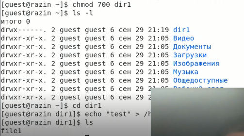

---
# Front matter
title: "Отчёт по лабораторной работе №2"
subtitle: "Дискреционное разграничение прав в Linux. Основные атрибуты"
author: "Разин Никита Андреевич, НБИбд-402-18" 

# Generic otions
lang: ru-RU
toc-title: "Содержание"

# Bibliography
bibliography: bib/cite.bib
csl: pandoc/csl/gost-r-7-0-5-2008-numeric.csl

# Pdf output format
toc: true # Table of contents
toc_depth: 2
lof: true # List of figures
lot: true # List of tables
fontsize: 12pt
linestretch: 1.5
papersize: a4
documentclass: scrreprt
## I18n
polyglossia-lang:
  name: russian
  options:
	- spelling=modern
	- babelshorthands=true
polyglossia-otherlangs:
  name: english
### Fonts
mainfont: PT Serif
romanfont: PT Serif
sansfont: PT Sans
monofont: PT Mono
mainfontoptions: Ligatures=TeX
romanfontoptions: Ligatures=TeX
sansfontoptions: Ligatures=TeX,Scale=MatchLowercase
monofontoptions: Scale=MatchLowercase,Scale=0.9
## Biblatex
biblatex: true
biblio-style: "gost-numeric"
biblatexoptions:
  - parentracker=true
  - backend=biber
  - hyperref=auto
  - language=auto
  - autolang=other*
  - citestyle=gost-numeric
## Misc options
indent: true
header-includes:
  - \linepenalty=10 # the penalty added to the badness of each line within a paragraph (no associated penalty node) Increasing the value makes tex try to have fewer lines in the paragraph.
  - \interlinepenalty=0 # value of the penalty (node) added after each line of a paragraph.
  - \hyphenpenalty=50 # the penalty for line breaking at an automatically inserted hyphen
  - \exhyphenpenalty=50 # the penalty for line breaking at an explicit hyphen
  - \binoppenalty=700 # the penalty for breaking a line at a binary operator
  - \relpenalty=500 # the penalty for breaking a line at a relation
  - \clubpenalty=150 # extra penalty for breaking after first line of a paragraph
  - \widowpenalty=150 # extra penalty for breaking before last line of a paragraph
  - \displaywidowpenalty=50 # extra penalty for breaking before last line before a display math
  - \brokenpenalty=100 # extra penalty for page breaking after a hyphenated line
  - \predisplaypenalty=10000 # penalty for breaking before a display
  - \postdisplaypenalty=0 # penalty for breaking after a display
  - \floatingpenalty = 20000 # penalty for splitting an insertion (can only be split footnote in standard LaTeX)
  - \raggedbottom # or \flushbottom
  - \usepackage{float} # keep figures where there are in the text
  - \floatplacement{figure}{H} # keep figures where there are in the text
---

# Цель работы

Получение практических навыков работы в консоли с атрибутами файлов, закрепление теоретических основ дискреционного разграничения доступа в современных системах с открытым кодом на базе ОС Linux.

# Задание

Получить практические навыки работы в консоли с атрибутами файлов и закрепить теоретические основы дискреционного разграничения доступа в современных системах с открытым кодом на базе ОС Linux.

# Теоретическое введение

Для каждого каталога и файла вы можете задать права доступа. Точнее права доступа автоматически задаются при создании каталога (файла), а вы, при необходимости, можете их изменить. Какая может быть необходимость?

Например, вам нужно, чтобы к вашему файлу-отчету смогли получить доступ пользователи — члены вашей группы. Или вы создали обычный текстовый файл, содержащий инструкции командного интерпретатора. Чтобы этот файл стал сценарием, вам нужно установить право на выполнение для этого файла. [[1]](https://itproffi.ru/atributy-fajlov-v-linux/)

Для записи кода режима доступа используется восьмеричная запись чисел. Как уже было отмечено, код доступа содержит три «триады» битов — для пользователя, группы и всех остальных, именно в таком порядке. Битам из первой триады соответствуют значения в восьмеричной записи 400, 200 и 100. Для второй триады (т. е. для группы) — 40, 20 и 10. Наконец, для третьей (все остальные) — 4, 2 и 1. В свою очередь, первому биту в каждой триаде соответствует доступ на чтение (r — «read»). Второму — на запись (w — «write») и третьему — на выполнение, т. е. x — «execute».[[2]](https://it.wikireading.ru/38589)

# Выполнение лабораторной работы

В установленной при выполнении предыдущей лабораторной работы операционной системе с помощью команды useradd guest необходимо было создать нового пользователя guest, также я задал пароль и после данные аунтефикации были успешно обновлены ([рис. 1](image/1.png))

{ #fig:001 width=70% }

После я вошел в систему от имени пользователя guest, запустил терминал, командой pwd определил директорию, в которой я находился, и именно она являлась моей домашней директорией, также уточнил имя пользователя командой whoami ([рис. 2](image/2.png))

{ #fig:003 width=70% }

Я уточнил имя пользователя, его группу, а также группы, куда входит пользователь, командой id. Выведенные значения uid, gid и др. запомнил.

Затем я просмотрел файл /etc/passwd командой cat /etc/passwd ([рис. 3](image/3.png), нашел в нём свою учётную запись ([рис. 3](image/3.png)). Uid пользователя = 1002, gid пользователя = 1002. Эти значения совпадают с полученными ранее.

{ #fig:008 width=70% }

Я определил существующие в системе директории командой ls -l /home/ ([рис. 4](image/4.png)) и получил список поддиректорий директории /home.

{ #fig:010 width=70% }

С помощью команды lsattr /home проверил, какие расширенные атрибуты установлены на поддиректориях, находящихся в директории /home. Я смог рассмотреть расширенные атрибуты директории, но при этом я не смог увидеть атрибуты директорий у других пользователей. ([рис. 4](image/4.png))

{ #fig:011 width=70% }

Далее я создал в домашней директории поддиректорию dir1, используя команду mkdir dir1. Определил командами ls -l ([рис. 5](image/5.png)).

{ #fig:012 width=70% }

{ #fig:013 width=70% }

После я снял с директории dir1 все атрибуты командой chmod 000 dir1 и проверила правильность выполнения команды с помощью команды lsattr. ([рис. 14](image/14.png))

{ #fig:014 width=70% }

Я попытался создать в директории dir1 файл file1 командой echo "test" > /home/guest1/dir1/file1. Я получил отказ в выполнении операции по созданию файла, потому что на предыдущем шаге я лишил владельца директории всех прав, включая право на запись.
Я не смог создать файл. Проверила командой ls -l /home/guest/dir1, файл file1 действительно не находится внутри директории dir1. Потом же дал директории право 700 и попытался создать снова файл file1, на этот раз он создался и я проверил это с помощью комнады ls внутри поддиректории.
Этот файл служил непосредственно файлом для проведения с ним операций, результаты которых заносились в таблицу([рис. 8](image/8.png))

{ #fig:015 width=70% }

После с помощью операций над расширением или урезанием прав на директорию и файл в нем, я проверял какие операции доступны для проведения над файлом/директорией, а какие нет. ([рис. 9](image/9.png))

{ #fig:017 width=70% }

Ниже приведены скриншоты данной таблицы :

{ #fig:017 width=70% }
{ #fig:017 width=70% }
На основании заполненной таблицы определила те или иные минимально необходимые права для выполнения операций внутри директории dir1 и заполнила таблицу. Для заполнения последних двух строк опытным путем проверила минимальные права. ([рис. 18](image/18.png))

Минимальные права для тех или иных операций сосредоточены в правом столбце **min**

# Выводы

Я получил практические навыки работы в консоли с атрибутами файлов, а также закрепил теоретические основы дискреционного разграничения доступа в современных системах с открытым кодом на базе ОС Linux.

# Список литературы{.unnumbered}

1. [Атрибуты файлов в Linux](https://itproffi.ru/atributy-fajlov-v-linux/)
2. [Права доступа и атрибуты файла.](https://it.wikireading.ru/38589)
